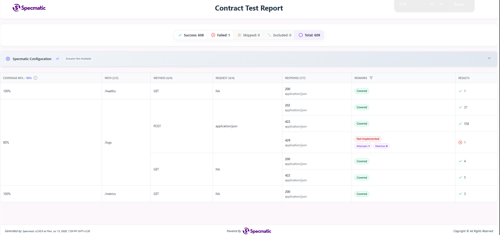
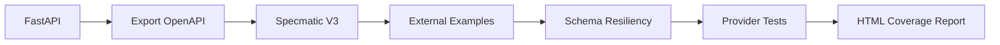
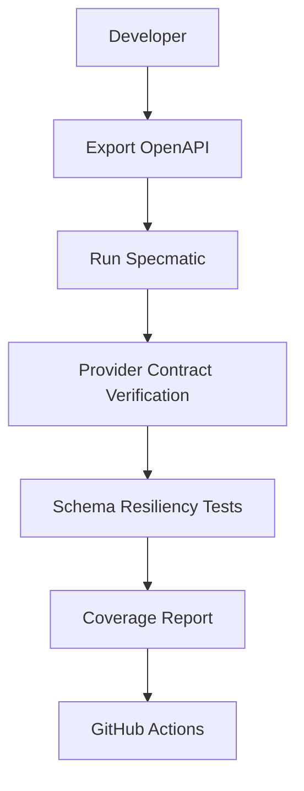

# Mini Datadog

Mini Datadog was built to explore backend observability concepts such as asynchronous log ingestion, real-time metrics aggregation, and anomaly detection. The project was later extended with Specmatic V3 to investigate how executable API contracts and schema resiliency testing improve API reliability.

> A FastAPI-based observability platform with executable API contracts using Specmatic.


Real-time log ingestion and anomaly detection platform with a queue-driven FastAPI backend, MongoDB persistence, in-memory metrics aggregation, and a React observability dashboard.

## Features

**Backend**
- Async log ingestion (`POST /logs`) with Pydantic validation and `202 Accepted` queue semantics
- Bounded in-memory queue with `429` backpressure on overflow
- Background worker with batch processing, supervisor restart, and graceful shutdown
- MongoDB persistence with startup indexes, singleton client, and transient-failure retries
- Processing engine with O(1) hashmap frequency tracking and 5-minute sliding-window error analytics
- Rule-based anomaly detection (`current_errors > 2x previous_errors`) with cooldown dedupe
- Best-effort in-memory deduplication (LRU + TTL)
- Pre-aggregated `/metrics` snapshot served without DB reads

**Frontend**
- Enterprise-style dark dashboard (sidebar, KPI cards, charts, recent logs, anomaly panel)
- Auto-refresh every 3 seconds from live backend APIs
- Chart.js visualizations: error trend line + logs-per-service bar chart
- Offline/empty states when the API is unavailable (no fake fallback data)

**Tooling**
- FastAPI-generated OpenAPI contract
- Specmatic V3 configuration
- Provider contract testing
- Externalized OpenAPI examples
- Schema resiliency testing
- API coverage reports
- HTML contract test reports
- OpenAPI export automation

## Tech Stack
| Layer | Stack |
|---|---|
| API | FastAPI, Uvicorn, Pydantic |
| Storage | MongoDB, PyMongo |
| Queue / Workers | queue.Queue, asyncio worker, batch inserts |
| Frontend | React, Vite, Tailwind CSS, Chart.js, Axios |
| Contracts & Testing | OpenAPI 3.x, Specmatic V3 |

## Project Structure

```text
Mini Datadog/
├── core/                 # config, MongoDB manager, ingestion queue
├── models/               # Pydantic request/response models
├── routes/               # /logs, /metrics, /healthz
├── services/             # worker, processing, storage, metrics, anomaly, dedupe
├── utils/
├── scripts/              # demo traffic, OpenAPI export, Specmatic helpers
├── contracts/openapi/    # exported API contract + examples
├── frontend/             # React dashboard
├── main.py
├── requirements.txt
└── system_design.md
```

## Architecture

```text
POST /logs
   |
   v
FastAPI validation
   |
   v
In-memory ingestion queue
   |
   v
Background worker (batch + dedupe + retries)
   |
   v
Processing engine + anomaly detection
   |
   v
MongoDB (logs collection)

React dashboard
   |
   +--> GET /metrics  (every 3s)
   +--> GET /logs     (every 3s)
```

See [system_design.md](system_design.md) for scaling strategy, trade-offs, and bottlenecks.

## Contract Testing Results

| Metric | Value |
|---|---:|
| Specmatic Configuration | V3 |
| Schema Resiliency Testing | Enabled |
| Total Tests Generated | 609 |
| Passed | 608 |
| Failed | 1 |
| API Coverage | 86% |


Schema resiliency testing automatically generates positive and negative request variations beyond the provided examples to validate API robustness. This moves the project from example-based validation to hundreds of automatically generated contract scenarios.


> API coverage is measured by Specmatic across the implemented operations. The remaining uncovered response is the HTTP 429 path for queue saturation, which is difficult to trigger deterministically because the production queue capacity is intentionally large.

## Executable API Contracts

This repository uses Specmatic so the OpenAPI document acts as an executable contract for the FastAPI backend. The contract is exported from the application and verified with provider tests, external examples, and schema resiliency checks.

The source contract is stored at [contracts/openapi/mini-datadog.openapi.json](contracts/openapi/mini-datadog.openapi.json).


## Key Learnings

- Migrated from Specmatic Config V2 to V3.
- Integrated executable API contracts into an existing FastAPI project.
- Used external OpenAPI examples for deterministic contract testing.
- Enabled schema resiliency testing to generate positive and negative scenarios.
- Generated HTML coverage reports.
- Identified implementation gaps using generated contract tests.
- Automated contract verification through GitHub Actions.

## API

### `GET /healthz`

```json
{ "status": "ok" }
```

### `POST /logs`

Minimal payload:

```json
{
  "service": "payment-service",
  "level": "ERROR",
  "message": "Payment failed"
}
```

Full payload supports `source`, `timestamp`, `attributes`, `tags`, `trace_id`, and `span_id`.

Returns `202 Accepted`:

```json
{
  "status": "accepted",
  "queue_depth": 1
}
```

Returns `429` when the ingestion queue is full.

### `GET /logs?limit=50`

Returns recent persisted logs from MongoDB (`limit`: 1–200), ordered by `processed_at` descending:

```json
{
  "logs": []
}
```

### `GET /metrics`

Returns a structured observability snapshot:

- `system_throughput` — received/processed/failed, queue depth, worker status, rejections, dedupe, DB failures, worker restarts
- `error_analytics` — total errors, current/previous 5-minute window counts
- `service_level_insights` — logs and errors per service
- `frequency_tracking` — `(service, level)` hashmap counts
- `anomaly_detection` — `anomaly_active` and `last_anomaly`

Interactive docs: `http://127.0.0.1:8000/docs`


## Run Locally
### Prerequisites

- Python 3.11+
- Node.js 20+
- MongoDB
- Java 17+

Default MongoDB:

```text
mongodb://localhost:27017
```

### Backend

```powershell
cd "D:\Mini Datadog"
pip install -r requirements.txt
python -m uvicorn main:app --host 127.0.0.1 --port 8000
```

```bash
cd Mini\ Datadog
pip3 install -r requirements.txt
python3 -m uvicorn main:app --host 127.0.0.1 --port 8000
```

### Frontend

```powershell
cd frontend
npm install
npm run dev
```
```bash
cd frontend
npm install
npm run dev
```

Open: `http://127.0.0.1:5173`

Optional API override:

Windows (PowerShell):
```powershell
$Env:VITE_API_BASE_URL = "http://127.0.0.1:8000"
```

macOS / Linux:
```bash
export VITE_API_BASE_URL=http://127.0.0.1:8000
```

## Demo Workflow

Generate traffic from the CLI:

Windows (PowerShell):
```powershell
cd "D:\Mini Datadog"
python scripts\generate_demo_traffic.py --count 80 --delay 0.03
```

macOS / Linux:
```bash
cd "Mini Datadog"
python3 scripts/generate_demo_traffic.py --count 80 --delay 0.03
```

Trigger an error spike (may activate anomaly detection):

Windows (PowerShell):
```powershell
python scripts\generate_demo_traffic.py --count 40 --delay 0.02 --spike
```

macOS / Linux:
```bash
python3 scripts/generate_demo_traffic.py --count 40 --delay 0.02 --spike
```

Anomaly rule: `current_window_errors > 2 * previous_window_errors` (requires `previous > 0`).

You can also ingest logs via Swagger UI (`/docs`) or `POST /logs` directly.

## Dashboard

The React UI includes:

- **Header** — live/disconnected status and last refresh time
- **KPI row** — Total Logs, Error Count, Error Rate, Queue Depth
- **Charts** — Error Trend (rolling window) and Logs per Service (top 8)
- **Recent Logs** — live table from `GET /logs`
- **Anomaly Panel** — active state, window comparison, worker status, last anomaly

Polling interval: **3 seconds**.


## Contract Testing Workflow

The project uses Specmatic V3 to validate the FastAPI service against its exported OpenAPI contract.



The workflow begins with the FastAPI application exporting its OpenAPI document, then uses Specmatic V3 together with external examples and schema resiliency checks to exercise the running service. The output is a coverage report and a contract-test report that can be reviewed locally or in CI.

### Local Contract Testing

1. Export the OpenAPI contract:
   Windows (PowerShell):
   ```powershell
   python scripts\export_openapi.py
   ```
   macOS / Linux:
   ```bash
   python3 scripts/export_openapi.py
   ```
2. Start MongoDB and the FastAPI server.
3. Run the provider tests with the V3 configuration:
   Windows (PowerShell):
   ```powershell
   .\scripts\run_specmatic_provider_tests.ps1
   ```
   macOS / Linux (PowerShell Core):
   ```bash
   pwsh ./scripts/run_specmatic_provider_tests.ps1
   ```
   Or:
   ```bash
   java -jar specmatic.jar test --config specmatic.yaml
   ```

Reports are written to [build/reports/specmatic/test/html/index.html](build/reports/specmatic/test/html/index.html), and the same workflow is exercised in [.github/workflows/specmatic-contract-tests.yml](.github/workflows/specmatic-contract-tests.yml).

## Testing Pipeline



This pipeline validates the contract locally and in CI without changing the runtime architecture.

## Repository Highlights

- FastAPI backend
- Queue-driven ingestion
- MongoDB persistence
- Real-time metrics
- Specmatic V3
- Schema resiliency testing
- GitHub Actions CI
- External OpenAPI examples

## Troubleshooting Contract Tests

**Test connection timeout:**
```
Ensure FastAPI is running and accessible at http://127.0.0.1:8000
curl http://127.0.0.1:8000/healthz
```

**MongoDB connection error:**
```
Start MongoDB: mongod --dbpath=./data
Check connection: mongosh
```

**Queue full (429) not triggered:**
```
By default, the queue holds 10,000 items (INGESTION_QUEUE_MAX_SIZE env var).
For testing queue saturation, set a smaller size:
INGESTION_QUEUE_MAX_SIZE=50 python -m uvicorn main:app --host 127.0.0.1 --port 8000
```

**Specmatic not found:**
```
Download JAR: 
curl -L https://github.com/specmatic/specmatic/releases/download/2.50.0/specmatic.jar \
  -o specmatic.jar

Verify Java is installed:
java -version
```

## Test Report Location

After running tests, view the HTML report:

**Local:**
```
build/reports/specmatic/test/html/index.html
```

**CI (GitHub Actions):**
1. Go to Actions → Latest workflow run
2. Click "specmatic-reports" artifact
3. Extract and open `index.html`

The report includes:
- ✓ Total tests run, passed, failed
- ✓ Coverage percentage by endpoint
- ✓ Detailed scenario results
- ✓ Request/response details for each test
- ✓ Failure reasons and contract mismatches

## Development Commands

Windows (PowerShell):
```powershell
# Frontend lint / build
cd frontend
npm run lint
npm run build
```

macOS / Linux:
```bash
# Frontend lint / build
cd frontend
npm run lint
npm run build
```

Windows (PowerShell):
```powershell
# Python syntax check
cd ..
python -m py_compile main.py routes\logs.py routes\metrics.py
```

macOS / Linux:
```bash
# Python syntax check
cd ..
python3 -m py_compile main.py routes/logs.py routes/metrics.py
```

Windows (PowerShell):
```powershell
# Quick API checks
Invoke-WebRequest -UseBasicParsing http://127.0.0.1:8000/metrics
Invoke-WebRequest -UseBasicParsing "http://127.0.0.1:8000/logs?limit=5"
```

macOS / Linux:
```bash
# Quick API checks
curl -sSf http://127.0.0.1:8000/metrics
curl -sSf "http://127.0.0.1:8000/logs?limit=5"
```

## Limitations

- Metrics and queue state are in-memory and reset on backend restart
- Queue is process-local (Kafka would replace this in production)
- Dedupe is best-effort and not shared across instances
- Anomaly detection is rule-based (no seasonality or statistical modeling yet)
- Dashboard polls REST endpoints (no WebSocket/SSE streaming)
- Schema Resiliency tests: 609 total with 1 hard-to-trigger scenario (429 under high load)

## Future Improvements

- Consumer-driven contract testing
- AsyncAPI support for Kafka
- Distributed tracing
- Docker Compose deployment
- OpenTelemetry
- ML-based anomaly detection